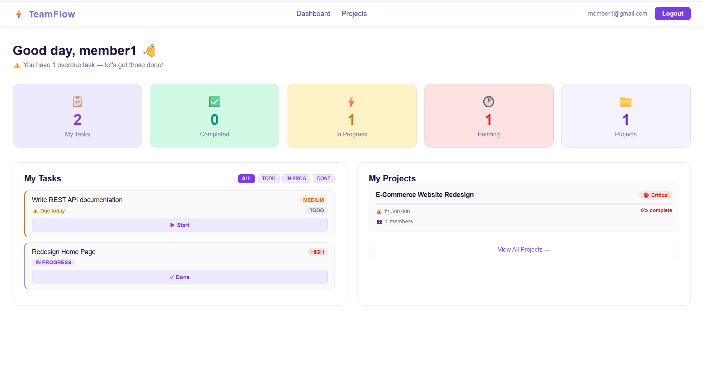
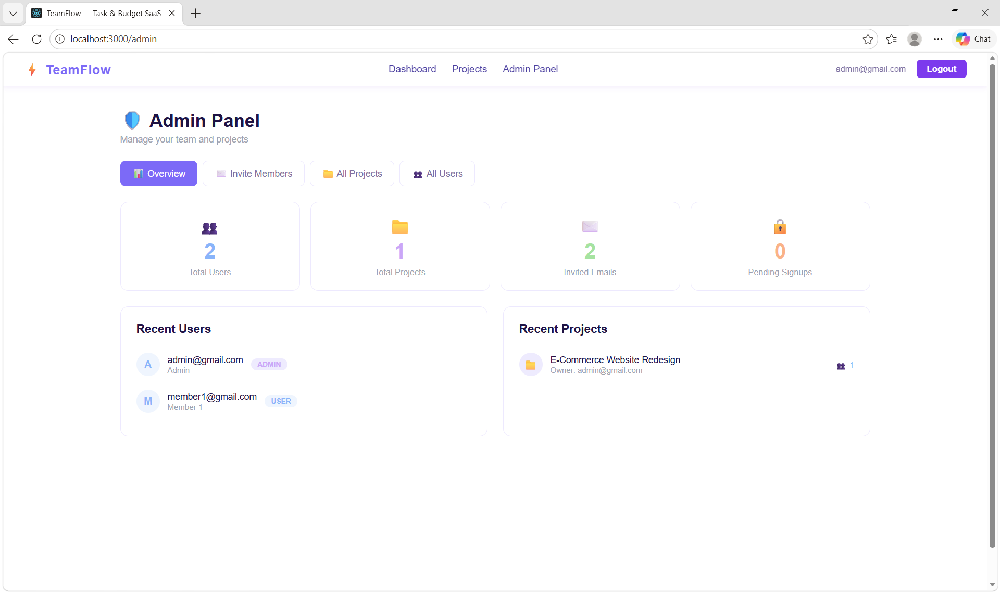
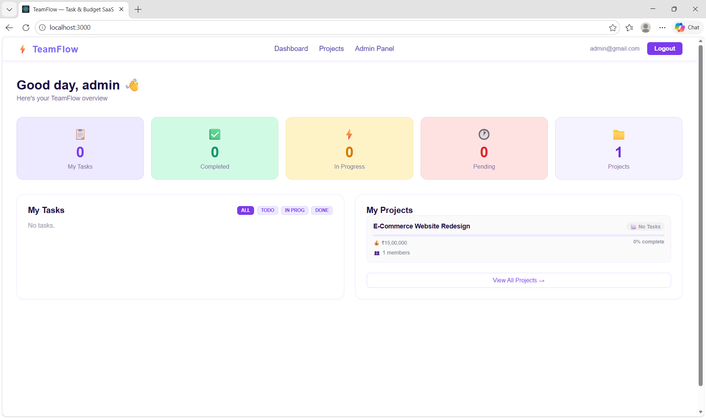
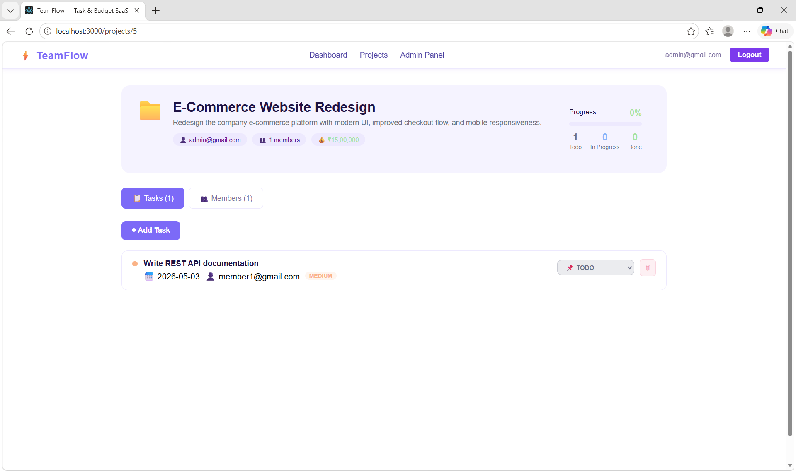

# TeamFlow — Task & Budget Management SaaS

Full-stack project management app with JWT auth, role-based access,
AI-powered insights, and real-time budget tracking.

## Tech stack
**Frontend:** React.js · JavaScript · CSS-in-JS · Axios  
**Backend:** Java 17 · Spring Boot 3.2 · Spring Security · JWT  
**Database:** PostgreSQL · Spring Data JPA · Hibernate  
**AI:** Groq API (llama3-8b-8192)  

## Features
- JWT authentication with role-based access (Admin / User)
- Project and task management with priority, status, due dates
- Expense tracking with budget analytics (SAFE/WARNING/CRITICAL)
- AI-powered project health insights via Groq API
- Team collaboration — invite and remove members per project
- Admin panel — manage all users and projects

## Project structure
teamflow/
├── frontend/     React.js app (port 3000)
└── backend/      Spring Boot REST API (port 8081)
## 📸 Screenshots

### 👥 Teammates

### 🔧 Admin Panel

### 🏠 Dashboard

### 📁 Projects

## Setup — backend
cd backend
copy application.properties.example to application.properties
fill in your DB credentials and API keys
mvn spring-boot:run

## Setup — frontend
cd frontend
npm install
npm start

## API endpoints
| Method | Endpoint                        | Access         |
|--------|---------------------------------|----------------|
| POST   | /auth/register                  | Public         |
| POST   | /auth/login                     | Public         |
| GET    | /projects                       | User           |
| GET    | /projects/all                   | Admin only     |
| PUT    | /tasks/{id}/status              | Assignee/Admin |
| GET    | /expenses/project/{id}/summary  | User           |
| GET    | /ai/project/{id}/analysis       | User           |

## Author
T Anusha — B.Tech CSE 2026, Hyderabad
LinkedIn: https://github.com/Anusha-Thotakura